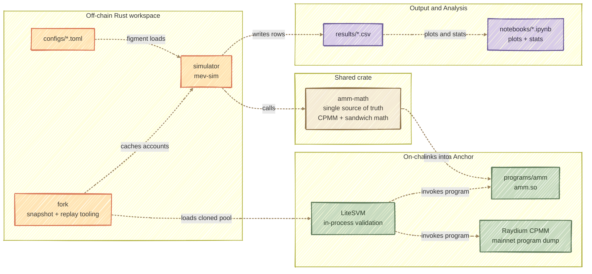

# Analiza podatności protokołów AMM na ataki typu MEV w sieci Solana

Praca magisterska - Politechnika Krakowska, Wydział Informatyki i Telekomunikacji, 2026

---

## What this project does

A Rust-based research workspace for studying MEV sandwich attacks on Solana
Automated Market Makers. Pure off-chain math (`amm-math`) drives parameterized
scenario sweeps, the same math backs a custom Anchor AMM program, and LiteSVM
tests validate both the custom program and cloned Raydium CPMM mainnet pools.

## Architecture



The `amm-math` crate is the single source of truth for swap math. The
off-chain simulator and the on-chain Anchor program link the same
functions for the custom AMM path, so on-chain validation reduces to comparing
pool state after executing the same trade sequence in both environments.
The custom AMM stores explicit multi-fee config
(`trade_fee_rate`, `creator_fee_rate`, `fee_denominator`,
`creator_fee_mode`) and calls `amm_math::multi_fee::compute_swap_multi_fee`;
the old single-fee behavior is represented by `creator_fee_rate = 0`.

For real-pool experiments, `fork` snapshots Raydium CPMM accounts from
mainnet, loads them into LiteSVM with the dumped Raydium program, and the
simulator can reuse the cached reserves and fee config for scenario sweeps.

## Sandwich attack data flow

A sandwich brackets a victim swap with an attacker frontrun (same
direction) and backrun (opposite direction). Reserves evolve across
three steps:

```mermaid
%%{init: {
  "look": "handDrawn",
  "themeVariables": {
    "fontFamily": "Comic Sans MS, Comic Sans, cursive",
    "background": "#FFF8E7",
    "primaryColor": "#FFF1CC",
    "primaryBorderColor": "#D97757",
    "primaryTextColor": "#3E3A34",
    "lineColor": "#8B6F47"
  }
}}%%
flowchart LR
    s0["step 0 (initial)<br/>reserves = (R_a, R_b)<br/>price = R_b / R_a"]:::pool
    s1["step 1 (after frontrun)<br/>(R_a + dA_f, R_b - dB_f)<br/>price of B rises"]:::pool
    s2["step 2 (after victim)<br/>(R_a + dA_f + dA_v,<br/>R_b - dB_f - dB_v')<br/>slippage may abort"]:::pool
    s3["step 3 (after backrun)<br/>(R_a', R_b')<br/>attacker realises PnL"]:::pool

    s0 -->|"① attacker frontruns<br/>dA_f of A → B"| s1
    s1 -->|"② victim swaps<br/>dA_v at degraded price"| s2
    s2 -->|"③ attacker backruns<br/>dB of B → A"| s3

    %% Link styling (hand-drawn-ish)
    linkStyle default stroke:#8B6F47,stroke-width:2px,opacity:0.85,stroke-dasharray:4 3;

    classDef pool fill:#FFE4B5,stroke:#D97757,stroke-width:2px,color:#3E3A34;
```



**Per-scenario metrics:**
- `tx_cost_per_leg = base_fee + priority_fee + compute_units × microLamports/CU + jito_tip`
- `tx_cost_total = 2 × tx_cost_per_leg`
- `attacker_net_profit = attacker_gross_profit − tx_cost_total`
- `victim_slippage = price_2 / price_0 − 1`
- `attack_feasible = victim_extra_slippage_bps <= slippage_tolerance_bps`
- `victim_reverted = !attack_feasible`

Each valid scenario records a CSV row. `attack_status` distinguishes an
executed attack from `no_profitable_attack` or `no_attack_configured`; no-attack
rows keep `frontrun_amount = 0`, zero attacker/victim loss metrics, and the
configured `tx_cost_per_leg` / `tx_cost_total` for traceability. CSV output also
includes normalized fields such as `victim_size_bps_of_reserve`,
`frontrun_size_bps_of_reserve`, `net_profit_bps_of_frontrun`, and
`victim_loss_bps_of_fair_out`.

## Directory structure

```
magisterka/
├── Cargo.toml              # workspace manifest (4 members)
├── crates/
│   └── amm-math/           # pure math: CPMM, multi-fee, sandwich optimizers
│       └── src/{lib,types}.rs
│       └── src/cpmm/{simple_fee,multi_fee}.rs
│       └── src/sandwich/{closed_form,numerical}.rs
├── programs/
│   └── amm/                # on-chain Anchor program (cdylib -> amm.so)
│       └── src/{lib,constants,errors}.rs
│       └── src/instructions/, src/state/
├── simulator/              # CLI binary `mev-sim`
│   └── src/{main,config,engine,real_pool,scenarios,output}.rs
├── fork/                   # Raydium CPMM snapshot + LiteSVM replay tooling
│   └── src/{account_fetcher,cheat,instructions,pool,
│            programs,state_loader}.rs
│   └── src/bin/snapshot.rs
├── configs/                # TOML inputs
│   ├── default.toml
│   ├── sweep_liquidity.toml
│   └── sweep_real_pool.toml
├── notebooks/              # Jupyter analysis notebooks (uv project)
├── fork/cache/             # generated mainnet account/program cache (gitignored)
└── results/                # generated CSV outputs (gitignored)
```

## Usage

```bash
# Build the workspace (host targets)
cargo build

# Run tests (includes amm-math proptests and LiteSVM integration tests)
cargo test --workspace --all-targets

# Single scenario from default config
cargo run --bin mev-sim -- -c configs/default.toml

# Parameter sweep, parallelized with rayon
cargo run --bin mev-sim -- -c configs/sweep_liquidity.toml --parallel

# Real-pool sweep using cached Raydium CPMM WSOL/SURGE snapshot
cargo run --bin mev-sim -- -c configs/sweep_real_pool.toml --parallel

# Closed-form vs numerical optimizer benchmark CSV
cargo run -p simulator --example bench_zhou_vs_numerical -- \
  -o results/zhou_vs_numerical.csv

# Custom output path
cargo run --bin mev-sim -- -c configs/default.toml -o results/my_test.csv

# Build the on-chain program to SBF bytecode (produces target/deploy/amm.so)
cargo-build-sbf --manifest-path programs/amm/Cargo.toml
```

Simulator attacker strategies are explicit: `closed_form` uses the Zhou
closed-form baseline, `numerical` uses the fee-aware optimizer, and `fixed`
uses `fixed_frontrun_amount`. Real-pool configs fail fast if the snapshot
cannot be loaded unless `real_pool.allow_synthetic_fallback = true` is set.

Raydium CPMM snapshot/replay tooling:

```bash
# Snapshot a Raydium CPMM pool into fork/cache/pools/<label>/
cargo run -p fork --bin snapshot -- \
  --pool BScfGKZf9YDfpL11hZQnCQPskPrdeyFcvCjSA5qupEH5 \
  --label wsol_surge \
  --rpc https://api.mainnet-beta.solana.com

# Dump the Raydium CPMM program used by fork LiteSVM tests
solana program dump \
  CPMMoo8L3F4NbTegBCKVNunggL7H1ZpdTHKxQB5qKP1C \
  fork/cache/programs/raydium_cpmm.so \
  --url mainnet-beta
```

Notebook analysis:

```bash
cd notebooks
uv sync
uv run jupyter lab
```

Some fork tests skip gracefully when `fork/cache/` fixtures or the Raydium
program dump are absent. The checked-in Rust code still builds and the custom
AMM LiteSVM test uses `target/deploy/amm.so`.

## Tech stack

- Rust 2021, Cargo workspace (4 crates)
- Anchor 1.0.1 (`anchor-lang`, `anchor-spl`) for the custom on-chain program
- Solana SDK 3.x (transitive, via Anchor)
- LiteSVM 0.11 — in-process Solana VM for custom AMM and Raydium CPMM replay
- CLI stack: `clap` (args), `figment` (TOML config), `rayon` (parallel
  sweeps), `csv` + `serde` (output), `itertools` (combinatorics)
- Raydium CPMM decoding: `carbon-raydium-cpmm-decoder` 0.12
- `proptest` for math-invariant testing in `amm-math`
- Python notebooks via `uv`, Jupyter, pandas, matplotlib, seaborn
