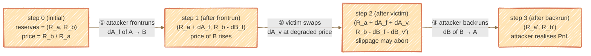

# Analiza podatności protokołów AMM na ataki typu MEV w sieci Solana

Praca magisterska - Politechnika Krakowska, Wydział Informatyki i Telekomunikacji, 2026

---

## What this project does

A Rust-based simulator for studying MEV sandwich attacks on Solana Automated
Market Makers. Pure off-chain math (`amm-math`) drives parameterized scenario
sweeps, and the same math crate backs an on-chain Anchor program so that
simulation results can be cross-validated against real program execution
inside LiteSVM (planned).

## Architecture

```mermaid
%%{init: {
  "look": "handDrawn",
  "themeVariables": {
    "fontFamily": "Comic Sans MS, Comic Sans, cursive",
    "background": "#FFF8E7",
    "primaryColor": "#FFF1CC",
    "primaryBorderColor": "#D97757",
    "primaryTextColor": "#3E3A34",
    "lineColor": "#8B6F47",
    "secondaryColor": "#E8D5B7",
    "tertiaryColor": "#F5EBD6"
  }
}}%%
flowchart LR
    subgraph OFFCHAIN["Off-chain Rust workspace"]
        cfg["configs/*.toml"]:::offchain
        sim["simulator<br/>mev-sim"]:::offchain
    end

    subgraph SHARED["Shared crate"]
        math["amm-math<br/>single source of truth"]:::shared
    end

    subgraph ONCHAIN["On-chain Solana Anchor"]
        prog["programs/amm<br/>amm.so"]:::onchain
        svm["LiteSVM<br/>&#40;planned&#41;"]:::planned
    end

    subgraph OUTPUT["Output and Analysis"]
        csv["results/*.csv"]:::output
        nb["Jupyter notebook<br/>&#40;planned&#41;"]:::planned
    end

    cfg -->|figment loads| sim
    sim -->|calls| math
    math -->|links into| prog
    sim -.->|planned: in-process VM| svm
    svm -->|invokes program| prog
    sim -->|writes rows| csv
    csv -.->|plots and stats| nb

    classDef offchain fill:#FFE4B5,stroke:#D97757,stroke-width:2px,color:#3E3A34;
    classDef shared fill:#F5EBD6,stroke:#8B6F47,stroke-width:2px,color:#3E3A34;
    classDef onchain fill:#C8DBC0,stroke:#5F7A5A,stroke-width:2px,color:#2E3E2A;
    classDef output fill:#D8CCE8,stroke:#6B5B95,stroke-width:2px,color:#2E2A3E;
    classDef planned fill:#F0E8D8,stroke:#999,stroke-width:2px,stroke-dasharray:6 4,color:#666;
```



The `amm-math` crate is the single source of truth for swap math. The
off-chain simulator and the on-chain Anchor program link the same
functions, so on-chain validation reduces to comparing pool state after
executing the same trade sequence in both environments.

## Sandwich attack data flow

A sandwich brackets a victim swap with an attacker frontrun (same
direction) and backrun (opposite direction). Reserves evolve across
three steps:



**Per-scenario metrics:**
- `attacker_pnl = A_out − dA_f − fees − tip`
- `victim_slippage = price_2 / price_0 − 1`
- swap aborts if `victim_slippage > slippage_tolerance_bps`

Each scenario records: attacker profit/loss, victim slippage, pool price
drift, gas and Jito tip costs, and whether the victim's slippage
tolerance aborted the trade.

## Directory structure

```
magisterka/
├── Cargo.toml              # workspace manifest (3 members)
├── crates/
│   └── amm-math/           # pure math: constant product + sandwich optimizer
│       └── src/{lib,constant_product,sandwich,types}.rs
├── programs/
│   └── amm/                # on-chain Anchor program (cdylib -> amm.so)
│       └── src/{lib,constants,errors}.rs
│       └── src/instructions/, src/state/
├── simulator/              # CLI binary `mev-sim`
│   └── src/{main,config,engine,scenarios,output}.rs
│   └── src/strategies/
├── configs/                # TOML inputs
│   ├── default.toml
│   └── sweep_liquidity.toml
└── results/                # generated CSV (gitignored)
```

## Usage

```bash
# Build the workspace (host targets)
cargo build

# Run tests (includes amm-math proptest invariants)
cargo test

# Single scenario from default config
cargo run --bin mev-sim -- -c configs/default.toml

# Parameter sweep, parallelized with rayon
cargo run --bin mev-sim -- -c configs/sweep_liquidity.toml --parallel

# Custom output path
cargo run --bin mev-sim -- -c configs/default.toml -o results/my_test.csv

# Build the on-chain program to SBF bytecode (produces target/deploy/amm.so)
cargo-build-sbf --manifest-path programs/amm/Cargo.toml
```

The resulting `amm.so` will be loaded into LiteSVM by the simulator for
on-chain validation once that integration lands (TODO; currently blocked
on a `solana-keypair` / `five8` upstream bug, see `programs/amm/Cargo.toml`).

## Tech stack

- Rust 2021, Cargo workspace (3 crates)
- Anchor 1.0.1 (`anchor-lang`, `anchor-spl`) for the on-chain program
- Solana SDK 3.x (transitive, via Anchor)
- LiteSVM — in-process Solana VM for on-chain validation (planned)
- CLI stack: `clap` (args), `figment` (TOML config), `rayon` (parallel
  sweeps), `csv` + `serde` (output), `itertools` (combinatorics)
- `proptest` for math-invariant testing in `amm-math`
